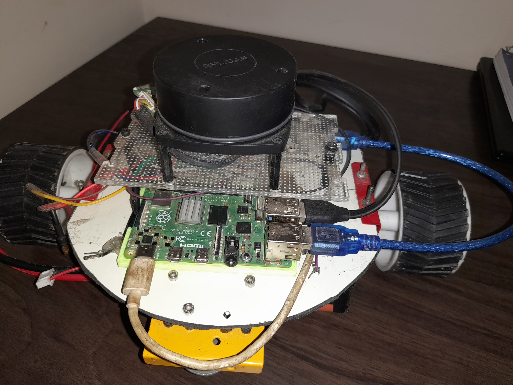

# Autonomous Mobile Robot project
[**Link to Robot in Action**](https://drive.google.com/file/d/1AUzYvMfg2nKVrtPNBEznKGtCIoOS9z_D/view?usp=sharing)



It is a nice (and time-consuming for me) robot which uses SLAM (ROS) with a RPLidar to navigate in its environment. It is powered by ROS running on a Raspberry Pi 4B and an Arduino that controls two motors with encoders.


In its current state the robot can use SLAM (gmapping) to create a map of its surroundings (using the RPLidar to detect wall and obstacles) and localize itself within the map. It can plan a path to a given goal and drive to it avoiding obstacles.

## Robot characteristics
This robot is a differential drive robot with the motors placed on the same axis. The base is made of wood with two caster wheels for support. The rest of the structure is made mainly of wood and metal brackets, easy to find in any DIY retail store.


### ROS packages
* #### nox_description:
This package includes the URDF description of the robot and the associated CAD files for display in RViz. The launch file "nox_rviz.launch" launches the joint and robot state publisher as well as RViz to display the model.

* #### nox:
This package includes the base controller node "nox_controller.cpp". This node will convert velocity command data into proper command data for the robot (according to the robot kinematic model) and send it to the Arduino Mega (through ROSSerial). It also computes the odometry (with the encoder data and according to the robot kinematic model) from data received from the Arduino Mega. The package also 
includes several launch files used to start the navigation (see "How to use Nox" below).

* #### Arduino:
The arduino node receives the command order from the base controller node and commands the motor speeds. It also sends back the encoder data needed for the odometry to the controller node through ROSSerial.

## How to use Nox
### Packages installation
The software for the Nox project was developped with ROS Noetic and Ubuntu 20. More recent versions should work as well but might require some tweaking. This readme doesn't explain how to install ROS and packages. For more information you can check the [ROS tutorials](http://wiki.ros.org/ROS/Tutorials).

#### To use Nox you will need the following packages (most of them should already be installed by default or requested when building the nox packages):
* The [navigation stack](https://wiki.ros.org/navigation),
* The freenect package (for connecting to the Kinect)
* [RViz](http://wiki.ros.org/rviz)
* [TF](http://wiki.ros.org/tf), [Joint State](http://wiki.ros.org/joint_state_publisher) and [Robot State](http://wiki.ros.org/robot_state_publisher) Publishers
* [ROSSerial package](http://wiki.ros.org/rosserial) (for connecting to the Arduino Mega)
* [SLAM gmapping](https://wiki.ros.org/slam_gmapping).
* [TEB local planner](https://wiki.ros.org/teb_local_planner).

#### Installation
You can install and build the package by copying the "nox" and "nox_description" folders in "your_catkin_workspace/src" on both your computer and the Raspberry Pi and running:
  ```
  catkin_make
  ```


You can then launch:

`roslaunch nox nox_slam.launch`

It will launch the move_base node and RViz. By using the "2D Nav Goal" arrow you can give a goal for the robot to reach. Alternatively, you can use the ROS teleop keyboard to control the robot:

`rosrun teleop_twist_keyboard teleop_twist_keyboard.py` 

